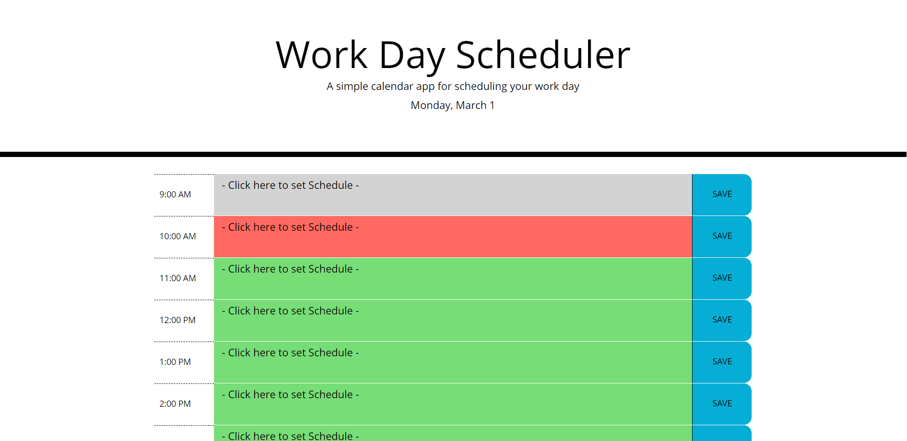
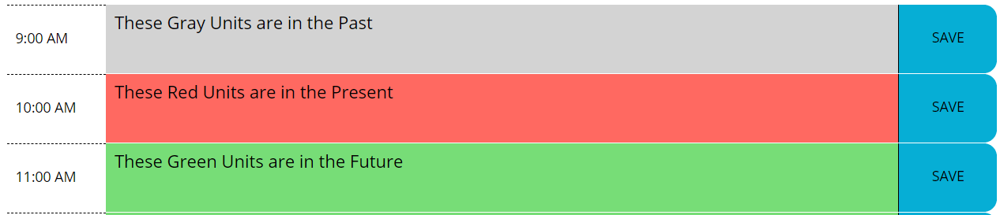

# Module-05-Challenge

This project was to make a funcional every day kind of scheduling web application.

## Work Day Scheduler

## Usage

Click on any hour range and type what you want to accomplish in that time zone. Be sure to click the save button, or your schedule for that hour might not be saved.

## Live Webpage

Click here to visit the webpage [LIVE](https://robertmcshinsky.github.io/Module-05-Challenge/)
